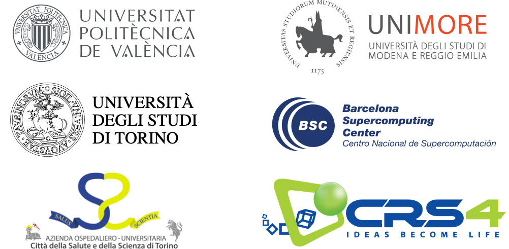

# DeepHealth Winter School 2022

Intense week in which the combination of lectures and lab exercises
will bring participants (1) closer to the use of deep learning and
computer vision in tasks related to medical imaging and other
medical data, and (2) to high-performance computing to considerably
reduce the running times of model-training processes.

---
From [here](figures/DHWS-flyer.pdf) you can download the flyer to distributed it everywhere (thanks in advance).

---

| ---: | :--- |
| Organised by | The DeepHealth project, an H2020 funded project with agreement number 825111 |
| ---: | :--- |
| Dates | January 24-28, 2022 [here you can find the schedule](figures/schedule.pdf) |
| ---: | :--- |
| Location | Only via Zoom |
| ---: | :--- |
| Target audience | Master’s degree students in AI/ML/DS and professionals from Industry with previous knowledge on Machine Learning. Linux user experience recommended. |
| | - PhD students |
| | - Data scientists & computer scientists with a Master’s Degree in Computer Science / Data Science / Artificial Intelligence / (other affine area like Mathematics or Physics), or in the process of completing it |
| | - Professionals from industry interested in the topics to be covered in the Winter School |
| | Experience with Linux and *shell-script* is recommended to all audiences types. |
| ---: | :--- |
| Registration | Via EventBrite in [this link](https://www.eventbrite.es/e/deephealth-winter-school-tickets-215923251257) |
| ---: | :--- |
| Contents | Deep Learning, Computer Vision, Medical Imaging and High-Performance Computing |
| ---: | :--- |

---

The DeepHealth Winter School will include theoretical sessions (master classes)
about the above enumerated four subjects, and lab sessions to show attendants
how the software created in the DeepHealth project can be installed and used.

Lab exercises will be guided by junior and senior researchers involved in the DeepHealth project.

---

## Involved partners

## Contents in detail

|[schedule](figures/schedule.pdf)

